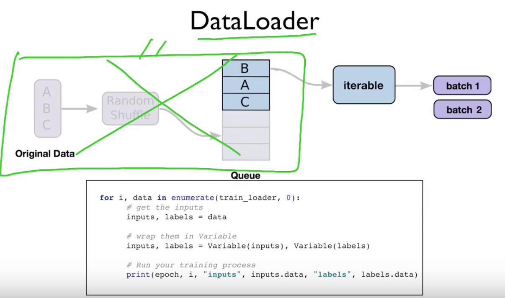

# 캡스톤 디자인 프로젝트(J&K project)

## Computerized labeling method different Retinal degeneration from Optical Coherence Tomography Images (OCT) based on convolutional neural networks

[Kaggle_Dataset](https://www.kaggle.com/paultimothymooney/kermany2018)

# 참고 웹사이트

[딥러닝 코드 기본이해](https://wikidocs.net/32105)

# 참고논문

[Automatic diagnosis of macular diseases from OCT volume based on its two-dimensional feature map and convolutional neural network with attention mechanism](https://www.spiedigitallibrary.org/journals/journal-of-biomedical-optics/volume-25/issue-9/096004/Automatic-diagnosis-of-macular-diseases-from-OCT-volume-based-on/10.1117/1.JBO.25.9.096004.full?&SSO=1&tab=ArticleLink)

[Automatic Classification of Retinal Optical Coherence Tomography Images With Layer Guided Convolutional Neural Network](https://ieeexplore.ieee.org/abstract/document/8718310/figures#figures)

---

# 사전학습된 모델을 분석하는 방법 (summary()함수 사용)

`INPUT_SHAPE = (150, 150, 3)`

`vgg16 = tf.keras.applications.VGG16(`

    include_top = False, 
    
    weights = 'imagenet', 
    
    input_tensor = None,
    
    input_shape = INPUT_SHAPE, 
    
    pooling = None, 
    
    classes = 1000
`)`

`vgg16.trainable = False`

`vgg16.summary()`

# 일반적인 모델을 분석하는 방법 (summary()함수 사용)

`model = tf.keras.models.Sequential([`   

    vgg16,
    
    tf.keras.layers.Conv2D(64, (3, 3), activation = 'relu'),
    
    tf.keras.layers.Flatten(),
    
    tf.keras.layers.Dense(100, activation = 'relu'),
    
    tf.keras.layers.Dense(4, activation = 'softmax')
    
`])`

`model.summary()`

---

### 구글colab 사용시마다 torvision을 따로 설치해주어야합니다.

`!pip3 install torchvision`

---

모델관련 파일 or train관련된 파일 발췌

어떤 파라미터를 사용했는지 이런거 보기

사람들이 많이 지정한 평균과 표준편차가 있다. 정규화하는 이유는 모든데이터의 범위자체를 균등하게 분포시켜서 빠르게 학습시킨다.

### 앞에 있는 layer와 노드를 동일하게 만들어야 오류가 나지 않는다. 

->`nn.Linear(10, 2)` : 10개의 input을 받고 2개의 output(=2개의 node)를 가지는 layer, Linear함수는 fully connected layer 1개를 의미함.

### 모르겠으면 print해봐라. `print(model_conv)` -> 모델의 구조가 print 됨

`model_conv.fc.in_features` -> layer마다 이름이 지정됨, fc도 layer이름, print(model_conv)로 모델의 구조를 print하고 fc layer를 확인해보자.

### 함수가 무슨 기능을 하는지 살펴보는 방법

`dataiter = iter(trainloader)`

`print(dataiter)`

---

# Pytorch에서는 항상 이미지를 tensor로 다룬다.

### tensor 형식의 이미지들은 4개의 채널이 있다. (데이터개수, 채널, Row, Column) 순서이다.                                        
                                                                     
### 우리가 데이터개수라는 인수를 제외한 데이터를 주면 텐서는 자동으로 (채널, Row, Column)순서로 형성된다.

넘파이 데이터형식은 (Row, Column, 채널)순서로 형성된다.

즉 pytorch에서 다룬 tensor를 numpy를 plot하는데 사용하는 plt.imshow()로 나타내기 위해서는 tensor를 numpy형식으로 인수의 순서를 바꾸어주어야 한다.

Tensor(채널, Row, Column) -> Numpy(Row, Column, 채널)

`Tensor(0, 1, 2) -> Numpy(1, 2, 0)`

`inp = inp.numpy().transpose((1, 2, 0))`
   
             plt.imshow(inp)
    
---

### 우리가 지정한 device(GPU0, GPU1, ... 중 하나)로 inputs과 labels를 옮겨 메모리에 저장한다.

`inputs = inputs.to(device)`

`labels = labels.to(device)`

### _, preds = torch.max(outputs, 1) 에서 torch.max는 outputs을 2개(labels과, predictions값)출력한다. Labels값은 사용하지 않을 것이므로 _,로 비운다. 이렇게 하는 이유는 outputs이 2개인 torch.max함수의 출력데이터 개수와 형식을 맞춰주어 오류를 방지하기 위해서이다. 

 `outputs = model(inputs)`
 
            _, preds = torch.max(outputs, 1)

### loss를 구하는 함수를 지정한다. CrossEntropyLoss()가 일반적이다. CrossEntorpyLoss()함수로 지정된 변수 criterion에 인수로 outputs, labels를 주면 모델이 출력한 Outputs과 우리가 아는 labels값을 비교하여 차이(손실, Loss)를 구한다.

`loss = criterion(outputs, labels)`

`criterion = nn.CrossEntropyLoss()`

### 모든 매개변수들이 최적화되었는지 관찰, 초기 LR(Learning Rate)를 0.001로 지정

`optimizer_ft = optim.SGD(model_ft.parameters(), lr=0.001, momentum=0.9)`

### 7 에폭마다 0.1씩 학습률 감소, 학습률이 0.001에서 7 epoch마다 0.1이 곱해지며 감소함. 0.001 * 0.1 per 7 epochs

`exp_lr_scheduler = lr_scheduler.StepLR(optimizer_ft, step_size=7, gamma=0.1)`

### model을 device(GPU)로 옮긴다.

`model_ft = model_ft.to(device)`

### _, preds = torch.max(outputs, 1) 에서 torch.max는 outputs을 2개(labels과, predictions값)출력한다. Labels값은 사용하지 않을 것이므로 _,로 비운다. 이렇게 하는 이유는 outputs이 2개인 torch.max함수의 출력데이터 개수와 형식을 맞춰주어 오류를 방지하기 위해서이다. 

 `outputs = model(inputs)`
 
            _, preds = torch.max(outputs, 1)

---

# 일부 이미지 시각화하기

numpy.clip(array,min,max) array내의 element들에 대해서 min값보다 작은 값들은 min값으로, max값보다 큰값들을 max값으로 바꿔주는 함수

`inp = np.clip(inp, 0, 1)` 

### 학습 데이터의 배치를 얻습니다.

`inputs, classes = next(iter(dataloaders['train']))`

These are built-in functions of python, they are used for working with iterables.

Basically iter() calls the __iter__() method on the iris_loader which returns an iterator. next() then calls the __next__() method on that iterator to get the first iteration. Running next() again will get the second item of the iterator, etc.

This logic often happens 'behind the scenes', for example when running a for loop. It calls the __iter__() method on the iterable, and then calls __next__() on the returned iterator until it reaches the end of the iterator. It then raises a stopIteration and the loop stops.

### num_workers

num_workers은 학습 도중 CPU의 작업을 몇 개의 코어를 사용해서 진행할지에 대한 설정 파라미터입니다. 해당 환경에서 사용 가능한 코어의 개수를 확인해보고 학습 외의 작업에 영향을 주지 않을 정도의 숫자로 설정해주시는 것이 좋습니다.

### Data_loader 함수 역할 도면

### ImageDataGenerator를 통한 트레이닝, 테스트 데이터 만들기

> Fitting the CNN to the images

`from keras.preprocessing.image import ImageDataGenerator` 

`train_datagen = ImageDataGenerator(rescale = 1./255,
                                   shear_range = 0.2,
                                   zoom_range = 0.2,
                                   horizontal_flip = True)`

`test_datagen = ImageDataGenerator(rescale = 1./255)`

shear_range: Float. Shear Intensity (Shear angle in counter-clockwise direction as radians)

zoom_range: Float or [lower, upper]. Range for random zoom. If a float,

horizontal_flip: Boolean. Randomly flip inputs horizontally.

rescale: rescaling factor. Defaults to None. If None or 0, no rescaling is applied, otherwise we multiply the data by the value provided (before applying any other transformation).

출처 https://keras.io/api/preprocessing/image/

---

### normalize your images! (ex: by 255?) therefore your model will train faster and could improve your accuracy

---

auc_1 = 0.9987 // Area Under Curve, ROC 커브 밑부분, 1에 가까울수록 좋음

f1score도 평가지표

train, val과 test셋 비율 조정=8:1:1

epoch 적어도 10 이상

---

### Overfitting vs Underfitting

When a model fails to capture important distinctions and patterns in the data, so it performs poorly even in training data, that is called underfitting.

Here's the takeaway: Models can suffer from either:

Overfitting: capturing spurious patterns that won't recur in the future, leading to less accurate predictions, or

Underfitting: failing to capture relevant patterns, again leading to less accurate predictions.

We use validation data, which isn't used in model training, to measure a candidate model's accuracy. This lets us try many candidate models and keep the best one.

---

### Decision Trees Vs Random Forests

Decision trees leave you with a difficult decision. A deep tree with lots of leaves will overfit because each prediction is coming from historical data from only the few houses at its leaf. But a shallow tree with few leaves will perform poorly because it fails to capture as many distinctions in the raw data.

Even today's most sophisticated modeling techniques face this tension between underfitting and overfitting. But, many models have clever ideas that can lead to better performance. We'll look at the random forest as an example.

The random forest uses many trees, and it makes a prediction by averaging the predictions of each component tree. It generally has much better predictive accuracy than a single decision tree and it works well with default parameters. If you keep modeling, you can learn more models with even better performance, but many of those are sensitive to getting the right parameters.

---

`cols_with_missing = [col for col in X_train.columns if X_train[col].isnull().any()]`

That is called a list comprehension you can find a lot of resources on the web talking about that. Basically It is a shorthand to create an empty vector and populate it using a loop.

Your example would be equivalent to this:

`cols_with_missing = []`

`for col in X_train.columns:`

  `if X_train[col].isnull().any():`
  
    cols_with_missing.append(col)
    
This code goes through all the columns in your dataframe and if a column has any null value, that column name is added to cols_with_missing

---

### Score from Approach 2 (Imputation)

Next, we use SimpleImputer to replace missing values with the mean value along each column.

Although it's simple, filling in the mean value generally performs quite well (but this varies by dataset). 

While statisticians have experimented with more complex ways to determine imputed values (such as regression imputation, for instance), the complex strategies typically give no additional benefit once you plug the results into sophisticated machine learning models.
