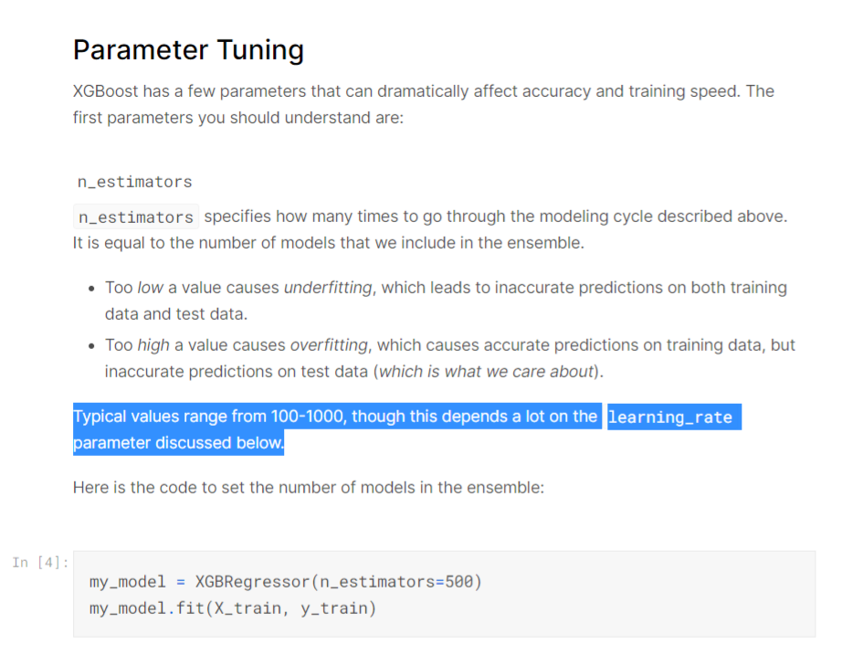

# 캡스톤 디자인 프로젝트(J&K project)

## Computerized labeling method different Retinal degeneration from Optical Coherence Tomography Images (OCT) based on convolutional neural networks

[Kaggle_Dataset](https://www.kaggle.com/paultimothymooney/kermany2018)

# 참고 웹사이트

[딥러닝 코드 기본이해](https://wikidocs.net/32105)

# 참고논문

[Automatic diagnosis of macular diseases from OCT volume based on its two-dimensional feature map and convolutional neural network with attention mechanism](https://www.spiedigitallibrary.org/journals/journal-of-biomedical-optics/volume-25/issue-9/096004/Automatic-diagnosis-of-macular-diseases-from-OCT-volume-based-on/10.1117/1.JBO.25.9.096004.full?&SSO=1&tab=ArticleLink)

[Automatic Classification of Retinal Optical Coherence Tomography Images With Layer Guided Convolutional Neural Network](https://ieeexplore.ieee.org/abstract/document/8718310/figures#figures)

---

# 데이터 형 변환 (처음에 항상 데이터 타입을 아는 것이 제일 중요하다)

Numpy array 형변환 하는 방법

Array를 통째로 형을 바꾸고 싶을때,

astype 명령어를 사용하면 됩니다.

---

# 사전학습된 모델을 분석하는 방법 (summary()함수 사용)

`INPUT_SHAPE = (150, 150, 3)`

`vgg16 = tf.keras.applications.VGG16(`

    include_top = False, 
    
    weights = 'imagenet', 
    
    input_tensor = None,
    
    input_shape = INPUT_SHAPE, 
    
    pooling = None, 
    
    classes = 1000
`)`

`vgg16.trainable = False`

`vgg16.summary()`

# 일반적인 모델을 분석하는 방법 (summary()함수 사용)

`model = tf.keras.models.Sequential([`   

    vgg16,
    
    tf.keras.layers.Conv2D(64, (3, 3), activation = 'relu'),
    
    tf.keras.layers.Flatten(),
    
    tf.keras.layers.Dense(100, activation = 'relu'),
    
    tf.keras.layers.Dense(4, activation = 'softmax')
    
`])`

`model.summary()`

---

### 구글colab 사용시마다 torvision을 따로 설치해주어야합니다.

`!pip3 install torchvision`

---

모델관련 파일 or train관련된 파일 발췌

어떤 파라미터를 사용했는지 이런거 보기

사람들이 많이 지정한 평균과 표준편차가 있다. 정규화하는 이유는 모든데이터의 범위자체를 균등하게 분포시켜서 빠르게 학습시킨다.

### 앞에 있는 layer와 노드를 동일하게 만들어야 오류가 나지 않는다. 

->`nn.Linear(10, 2)` : 10개의 input을 받고 2개의 output(=2개의 node)를 가지는 layer, Linear함수는 fully connected layer 1개를 의미함.

### 모르겠으면 print해봐라. `print(model_conv)` -> 모델의 구조가 print 됨

`model_conv.fc.in_features` -> layer마다 이름이 지정됨, fc도 layer이름, print(model_conv)로 모델의 구조를 print하고 fc layer를 확인해보자.

### 함수가 무슨 기능을 하는지 살펴보는 방법

`dataiter = iter(trainloader)`

`print(dataiter)`

---

# Pytorch에서는 항상 이미지를 tensor로 다룬다.

### tensor 형식의 이미지들은 4개의 채널이 있다. (데이터개수, 채널, Row, Column) 순서이다.                                        
                                                                     
### 우리가 데이터개수라는 인수를 제외한 데이터를 주면 텐서는 자동으로 (채널, Row, Column)순서로 형성된다.

넘파이 데이터형식은 (Row, Column, 채널)순서로 형성된다.

즉 pytorch에서 다룬 tensor를 numpy를 plot하는데 사용하는 plt.imshow()로 나타내기 위해서는 tensor를 numpy형식으로 인수의 순서를 바꾸어주어야 한다.

Tensor(채널, Row, Column) -> Numpy(Row, Column, 채널)

`Tensor(0, 1, 2) -> Numpy(1, 2, 0)`

`inp = inp.numpy().transpose((1, 2, 0))`
   
             plt.imshow(inp)
    
---

### 우리가 지정한 device(GPU0, GPU1, ... 중 하나)로 inputs과 labels를 옮겨 메모리에 저장한다.

`inputs = inputs.to(device)`

`labels = labels.to(device)`

### _, preds = torch.max(outputs, 1) 에서 torch.max는 outputs을 2개(labels과, predictions값)출력한다. Labels값은 사용하지 않을 것이므로 _,로 비운다. 이렇게 하는 이유는 outputs이 2개인 torch.max함수의 출력데이터 개수와 형식을 맞춰주어 오류를 방지하기 위해서이다. 

 `outputs = model(inputs)`
 
            _, preds = torch.max(outputs, 1)

### loss를 구하는 함수를 지정한다. CrossEntropyLoss()가 일반적이다. CrossEntorpyLoss()함수로 지정된 변수 criterion에 인수로 outputs, labels를 주면 모델이 출력한 Outputs과 우리가 아는 labels값을 비교하여 차이(손실, Loss)를 구한다.

`loss = criterion(outputs, labels)`

`criterion = nn.CrossEntropyLoss()`

### 모든 매개변수들이 최적화되었는지 관찰, 초기 LR(Learning Rate)를 0.001로 지정

`optimizer_ft = optim.SGD(model_ft.parameters(), lr=0.001, momentum=0.9)`

### 7 에폭마다 0.1씩 학습률 감소, 학습률이 0.001에서 7 epoch마다 0.1이 곱해지며 감소함. 0.001 * 0.1 per 7 epochs

`exp_lr_scheduler = lr_scheduler.StepLR(optimizer_ft, step_size=7, gamma=0.1)`

### model을 device(GPU)로 옮긴다.

`model_ft = model_ft.to(device)`

### _, preds = torch.max(outputs, 1) 에서 torch.max는 outputs을 2개(labels과, predictions값)출력한다. Labels값은 사용하지 않을 것이므로 _,로 비운다. 이렇게 하는 이유는 outputs이 2개인 torch.max함수의 출력데이터 개수와 형식을 맞춰주어 오류를 방지하기 위해서이다. 

 `outputs = model(inputs)`
 
            _, preds = torch.max(outputs, 1)

---

# 일부 이미지 시각화하기

numpy.clip(array,min,max) array내의 element들에 대해서 min값보다 작은 값들은 min값으로, max값보다 큰값들을 max값으로 바꿔주는 함수

`inp = np.clip(inp, 0, 1)` 

### 학습 데이터의 배치를 얻습니다.

`inputs, classes = next(iter(dataloaders['train']))`

These are built-in functions of python, they are used for working with iterables.

Basically iter() calls the __iter__() method on the iris_loader which returns an iterator. next() then calls the __next__() method on that iterator to get the first iteration. Running next() again will get the second item of the iterator, etc.

This logic often happens 'behind the scenes', for example when running a for loop. It calls the __iter__() method on the iterable, and then calls __next__() on the returned iterator until it reaches the end of the iterator. It then raises a stopIteration and the loop stops.

### num_workers

num_workers은 학습 도중 CPU의 작업을 몇 개의 코어를 사용해서 진행할지에 대한 설정 파라미터입니다. 해당 환경에서 사용 가능한 코어의 개수를 확인해보고 학습 외의 작업에 영향을 주지 않을 정도의 숫자로 설정해주시는 것이 좋습니다.

### Data_loader 함수 역할 도면

### ImageDataGenerator를 통한 트레이닝, 테스트 데이터 만들기

> Fitting the CNN to the images

`from keras.preprocessing.image import ImageDataGenerator` 

`train_datagen = ImageDataGenerator(rescale = 1./255,
                                   shear_range = 0.2,
                                   zoom_range = 0.2,
                                   horizontal_flip = True)`

`test_datagen = ImageDataGenerator(rescale = 1./255)`

shear_range: Float. Shear Intensity (Shear angle in counter-clockwise direction as radians)

zoom_range: Float or [lower, upper]. Range for random zoom. If a float,

horizontal_flip: Boolean. Randomly flip inputs horizontally.

rescale: rescaling factor. Defaults to None. If None or 0, no rescaling is applied, otherwise we multiply the data by the value provided (before applying any other transformation).

출처 https://keras.io/api/preprocessing/image/

---

### normalize your images! (ex: by 255?) therefore your model will train faster and could improve your accuracy

---

auc_1 = 0.9987 // Area Under Curve, ROC 커브 밑부분, 1에 가까울수록 좋음

f1score도 평가지표

train, val과 test셋 비율 조정=8:1:1

epoch 적어도 10 이상

---

### Overfitting vs Underfitting

When a model fails to capture important distinctions and patterns in the data, so it performs poorly even in training data, that is called underfitting.

Here's the takeaway: Models can suffer from either:

Overfitting: capturing spurious patterns that won't recur in the future, leading to less accurate predictions, or

Underfitting: failing to capture relevant patterns, again leading to less accurate predictions.

We use validation data, which isn't used in model training, to measure a candidate model's accuracy. This lets us try many candidate models and keep the best one.

---

### Decision Trees Vs Random Forests

Decision trees leave you with a difficult decision. A deep tree with lots of leaves will overfit because each prediction is coming from historical data from only the few houses at its leaf. But a shallow tree with few leaves will perform poorly because it fails to capture as many distinctions in the raw data.

Even today's most sophisticated modeling techniques face this tension between underfitting and overfitting. But, many models have clever ideas that can lead to better performance. We'll look at the random forest as an example.

The random forest uses many trees, and it makes a prediction by averaging the predictions of each component tree. It generally has much better predictive accuracy than a single decision tree and it works well with default parameters. If you keep modeling, you can learn more models with even better performance, but many of those are sensitive to getting the right parameters.

---

### Score from Approach 2 (Imputation)

Next, we use SimpleImputer to replace missing values with the mean value along each column.

Although it's simple, filling in the mean value generally performs quite well (but this varies by dataset). 

While statisticians have experimented with more complex ways to determine imputed values (such as regression imputation, for instance), the complex strategies typically give no additional benefit once you plug the results into sophisticated machine learning models.

---

# 데이터 타입

### object type

An object type is a user-defined composite datatype that encapsulates a data structure along with the functions and procedures needed to manipulate the data. The variables that form the data structure are called attributes.

Next, we obtain a list of all of the categorical variables in the training data.

We do this by checking the data type (or dtype) of each column. The object dtype indicates a column has text (there are other things it could theoretically be, but that's unimportant for our purposes). For this dataset, the columns with text indicate categorical variables.

---

### Sparse matrix

Score from Approach 3 (One-Hot Encoding)
We use the OneHotEncoder class from scikit-learn to get one-hot encodings. There are a number of parameters that can be used to customize its behavior.

>We set handle_unknown='ignore' to avoid errors when the validation data contains classes that aren't represented in the training data, and

>setting sparse=False ensures that the encoded columns are returned as a numpy array (instead of a sparse matrix).

To use the encoder, we supply only the categorical columns that we want to be one-hot encoded. For instance, to encode the training data, we supply X_train[object_cols]. (object_cols in the code cell below is a list of the column names with categorical data, and so X_train[object_cols] contains all of the categorical data in the training set.)

from sklearn.preprocessing import OneHotEncoder

### Apply one-hot encoder to each column with categorical data

`OH_encoder = OneHotEncoder(handle_unknown='ignore', sparse=False)`

`OH_cols_train = pd.DataFrame(OH_encoder.fit_transform(X_train[object_cols]))`

`OH_cols_valid = pd.DataFrame(OH_encoder.transform(X_valid[object_cols]))`

### One-hot encoding removed index; put it back <- 원-핫 인코딩으로 빼낸 Columns를 다시 원래 인덱스로 맞춰줍니다

`OH_cols_train.index = X_train.index`

`OH_cols_valid.index = X_valid.index`

### Remove categorical columns (will replace with one-hot encoding)

`num_X_train = X_train.drop(object_cols, axis=1)`

`num_X_valid = X_valid.drop(object_cols, axis=1)`

### Add one-hot encoded columns to numerical features

`OH_X_train = pd.concat([num_X_train, OH_cols_train], axis=1)`

`OH_X_valid = pd.concat([num_X_valid, OH_cols_valid], axis=1)`

`print("MAE from Approach 3 (One-Hot Encoding):")`

`print(score_dataset(OH_X_train, OH_X_valid, y_train, y_valid))`

---

### [inplace parameter](https://jman4190.medium.com/explaining-the-inplace-parameter-for-beginners-5de7ffa18d2e)

Reviewing the inplace parameter one last time

To sum it up nicely for you, you can think of the True and False setting for the inplace parameter as follows:

When inplace = True, the data is modified in place, which means it will return nothing and the dataframe is now updated.

When inplace = False, which is the default, then the operation is performed and it returns a copy of the object. You then need to save it to something. That something can be a new variable or the same variable name.

Bonus section for making it this far!

The inplace parameter is commonly used with the following methods:

>`dropna()`
>`drop_duplicates()`
>`fillna()`
>`query()`
>`rename()`
>`reset_index()`
>`sort_index()`
>`sort_values()`

`import pandas as pd`

`from sklearn.model_selection import train_test_split`

### Read the data

`X = pd.read_csv('../input/train.csv', index_col='Id')`

`X_test = pd.read_csv('../input/test.csv', index_col='Id')`

### Remove rows with missing target, separate target from predictors

`X.dropna(axis=0, subset=['SalePrice'], inplace=True)` <- SalePrice Column에서 데이터가 없는 자료(NaN)를 포함하는 Row를 제거하여 저장(inplace=True)

`y = X.SalePrice`

`X.drop(['SalePrice'], axis=1, inplace=True)` <- SalePrice Column을 제거하여 저장(inplace=True)

### To keep things simple, we'll drop columns with missing values

### `cols_with_missing = [col for col in X.columns if X[col].isnull().any()]` 

`X.drop(cols_with_missing, axis=1, inplace=True)` <- null을 포함하는 columns(axis=1)를 제거한뒤 저장(inplace=True)

`X_test.drop(cols_with_missing, axis=1, inplace=True)` <- null을 포함하는 columns(axis=1)를 제거한뒤 저장(inplace=True)

### Break off validation set from training data

`X_train, X_valid, y_train, y_valid = train_test_split(X, y,
                                                      train_size=0.8, test_size=0.2,
                                                      random_state=0)`

---

### `cols_with_missing = [col for col in X_train.columns if X_train[col].isnull().any()]`

That is called a list comprehension you can find a lot of resources on the web talking about that. Basically It is a shorthand to create an empty vector and populate it using a loop.

Your example would be equivalent to this:

`cols_with_missing = []`

`for col in X_train.columns:`

  `if X_train[col].isnull().any():`
  
    cols_with_missing.append(col)
    
This code goes through all the columns in your dataframe and if a column has any null value, that column name is added to cols_with_missing

---

# One-Hot Encoding

## categorical data를 일단 DataFrame의 Columns에서 제거

### Drop columns in training and validation data

`drop_X_train = X_train.select_dtypes(exclude=['object'])` <- categorical 데이터인 dtype=object인 항목을 제외하고 선택

`drop_X_valid = X_valid.select_dtypes(exclude=['object'])` <- categorical 데이터인 dtype=object인 항목을 제외하고 선택

---

### 1.low cardinality cols(많은 unique entries을 갖는) columns을 원-핫 인코딩합니다

### Apply one-hot encoder to each column with categorical data

`OH_encoder = OneHotEncoder(handle_unknown='ignore', sparse=False)`

`OH_cols_train = pd.DataFrame(OH_encoder.fit_transform(X_train[low_cardinality_cols]))`

`OH_cols_valid = pd.DataFrame(OH_encoder.transform(X_valid[low_cardinality_cols]))`

### 2.원-핫 인코딩으로 빼낸 Columns를 다시 원래 인덱스로 맞춰줍니다

### One-hot encoding removed index; put it back

`OH_cols_train.index = X_train.index`

`OH_cols_valid.index = X_valid.index`

### 3.Categorical columns를 제거합니다

### Remove categorical columns (will replace with one-hot encoding)

`num_X_train = X_train.drop(object_cols, axis=1)`

`num_X_valid = X_valid.drop(object_cols, axis=1)`

### 4.원-핫 인코딩된 columns를 numerical features를 갖는 열에 붙여줍니다(concatenate)

### Add one-hot encoded columns to numerical features

`OH_X_train = pd.concat([num_X_train, OH_cols_train], axis=1)`

`OH_X_valid = pd.concat([num_X_valid, OH_cols_valid], axis=1)`

---

## Investigating cardinality

The output above shows, for each column with categorical data, the number of unique values in the column. 

For instance, the 'Street' column in the training data has two unique values: 'Grvl' and 'Pave', corresponding to a gravel road and a paved road, respectively.

We refer to the number of unique entries of a categorical variable as the cardinality of that categorical variable. For instance, the 'Street' variable has cardinality 2.

---

## 집합 자료형은 어떻게 만들까?

집합(set)은 파이썬 2.3부터 지원하기 시작한 자료형으로, 집합에 관련된 것을 쉽게 처리하기 위해 만든 자료형이다.

집합 자료형은 다음과 같이 set 키워드를 사용해 만들 수 있다.

`>>> s1 = set([1,2,3])`

`>>> s1`

`{1, 2, 3}`

위와 같이 set()의 괄호 안에 리스트를 입력하여 만들거나 다음과 같이 문자열을 입력하여 만들 수도 있다.

`>>> s2 = set("Hello")`

`>>> s2`

`{'e', 'H', 'l', 'o'}`

※ 비어 있는 집합 자료형은 s = set()로 만들수 있다.

### 집합 자료형의 특징

자, 그런데 위에서 살펴본 set("Hello")의 결과가 좀 이상하지 않은가? 분명 "Hello" 문자열로 set 자료형을 만들었는데 생성된 자료형에는 l 문자가 하나 빠져 있고 순서도 뒤죽박죽이다. 그 이유는 set에 다음과 같은 2가지 큰 특징이 있기 때문이다.

>중복을 허용하지 않는다.

>순서가 없다(Unordered).

리스트나 튜플은 순서가 있기(ordered) 때문에 인덱싱을 통해 자료형의 값을 얻을 수 있지만 set 자료형은 순서가 없기(unordered) 때문에 인덱싱으로 값을 얻을 수 없다. 이는 마치 02-5에서 살펴본 딕셔너리와 비슷하다. 딕셔너리 역시 순서가 없는 자료형이라 인덱싱을 지원하지 않는다.

만약 set 자료형에 저장된 값을 인덱싱으로 접근하려면 다음과 같이 리스트나 튜플로 변환한후 해야 한다.

---

### Cross validation

Conclusion

Using cross-validation yields a much better measure of model quality, with the added benefit of cleaning up our code: note that we no longer need to keep track of separate training and validation sets. So, especially for small datasets, it's a good improvement!

---

## 시각화 도구 matplotlib

첫 번째 줄에서 %matplotlib inline 의 역할은 notebook을 실행한 브라우저에서 바로 그림을 볼 수 있게 해주는 것 입니다.

---

n_estimators_best = min(results, key=results.get) <- results 딕셔너리형 자료에서 key : value 쌍에서 value값이 가장 작은 key값을 반환합니다, 즉 results[200]이 최소값이면 results[200]의 key값인 200을 반환합니다 -> n_estimators_best = 200

---

---

---

---

---

---

# Data_Leakage

## Data_Leakage Problem을 방지하기 위해 항상 데이터셋에서 train과 test셋으로 분리한 뒤에 빠져있는 NaN 값을 각각의 평균값, 최빈값 등등으로 preprocessing 해줍니다.

만약 데이터셋을 train과 test로 split하기 전에 NaN값을 preprocessing하면 test셋의 데이터가 train셋의 데이터에 영향을 주게 됩니다

이는 추후 예측모델을 구현할 때 우리가 사용한 test accuracy는 상대적으로 높게 나오지만 실제 모델을 다른 데이터셋에 대해 예측할 때는 accuracy가 떨어지는 현상, 즉 overfitting 현상을 유발합니다. 따라서 극히 주의하여야 합니다.

---

# 평가지표

# CV_score <- Cross validation score

# Recall

# Precision

# F1_Score

---

# Tokenizer

먼저 Tokenization이 무엇인가에 대해 알아야 할 것 같습니다.
 
간단하게 말하면 Tokenization이란 Text를 여러개의 Token으로 나누는 것을 말합니다.
 
보통 공백, 구두점, 특수문자 등으로 이를 나누는데요. 그 방법에 따라 다양한 Tokenizer가 있습니다.
 
그리고 이런 Tokenization을 하는 것을 Tokenizer라고 합니다.

---

# Embedding

임베딩 중 가장 단순한 방법이 One-hot encoding을 통한 것이다. 허나, 이러한 Sparse matrix를 통한 계산은 너무 비효율적이다. 그렇다면 어떻게 dense하게 표현할 수 있을지를 고민하는 것이 바로 Embedding이라는 개념의 본질일 것이다.

### 자연어처리에서 임베딩이란?

자연어 처리(Natural Language Processing)분야에서 임베딩(Embedding)은 사람이 쓰는 자연어를 기계가 이해할 수 있는 숫자형태인 vector로 바꾼 결과 혹은 그 일련의 과정 전체를 의미한다. 가장 간단한 형태의 임베딩은 단어의 빈도를 그대로 벡터로 사용하는 것이다. 단어-문서 행렬(Term-Document Matrix)는 row는 단어 column은 문서에 대응한다.
